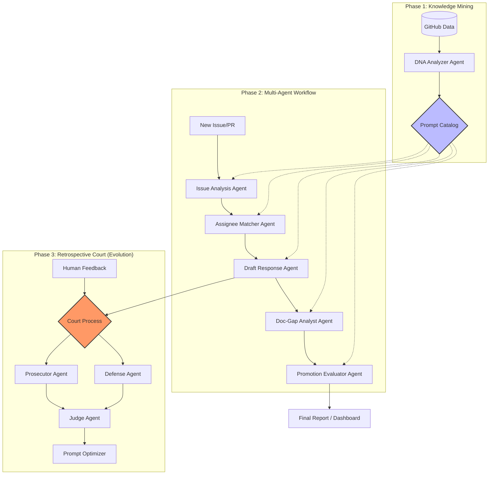

# 팀명

OMG (Oh My GPT)

# 프로젝트

### Prism: Self-Evolving DevRel OS


> **"조직의 DNA를 복제하여 전문성을 스케일링하다."**

> Prism은 Closed 데이터에서 조직의 협업 패턴을 추출하고, 멀티 에이전트 기반의 '회고 법정(Retrospective Court)'을 통해 스스로 성능을 고도화하는 기업용 DevRel 운영 자동화 플랫폼입니다.

---

## 문제 정의 (Problem Definition)

### 기술 지원의 병목과 지식의 파편화

성장하는 테크 기업에서 DevRel 및 오픈소스 관리 조직은 다음과 같은 고질적인 **스케일링 문제**에 직면합니다.

* **폭발적인 운영 비용**: 커뮤니티와 사용자 이슈는 기하급수적으로 늘어나지만, 숙련된 엔지니어의 시간은 한정되어 있어 응대 지연 및 품질 저하가 발생합니다.
* **Tribal Knowledge**: 수천 개의 Closed Issue/PR에는 조직만의 해결 노하우와 커뮤니케이션 톤앤매너가 담겨 있으나, 이는 정형화되지 못한 채 방치됩니다.
* **문서와 실무의 괴리**: 코드는 업데이트되지만 공식 문서는 뒤처지는 문서화 갭이 발생하며, 이는 반복적인 중복 질문으로 이어져 운영 효율을 저해합니다.

### 왜 생성형 AI와 멀티 에이전트인가?

기본적인 룰베이스 봇은 복잡한 기술적 컨텍스트를 이해하지 못하며, 단순 RAG는 조직 특유의 의사결정 방식(가이드라인)을 반영하지 못합니다. 
**Prism은 단순 응답을 넘어, 에이전트 간 논쟁과 피드백 루프를 통해 조직의 전문성을 디지털화**함으로써 이 문제를 해결합니다.

---

## 솔루션 (Solution)

Prism은 세 가지 핵심 레이어를 통해 DevRel 워크플로우를 만들었습니다.

### 1단계: DNA Extraction & Persona Customization (Knowledge Mining)

* **기능**: 과거의 우수 사례(Closed Issue/PR)를 분석하여 조직 고유의 **협업 가이드라인**을 추출합니다.
* **차별점**: 일반적인 시스템 프롬프트 대신, 분석 에이전트가 조직의 기술 스택과 톤앤매너가 주입된 **5종의 전문 페르소나 에이전트용 맞춤형 프롬프트**를 동적으로 생성합니다.

### 2단계: Multi-Agent Collaborative Triage (Operational)

신규 이슈 발생 시, 전문화된 에이전트 군단이 유기적으로 협업합니다.

1. **Issue Analysis**: 기술적 핵심 파악 및 긴급도 분류.
2. **Assignment**: 기여 히스토리 기반 최적의 담당자 추천.
3. **Drafting**: 조직의 가이드라인을 준수한 고품질 답변 초안 생성.
4. **Doc-Gap Analysis**: 이슈 해결 과정에서 수정이 필요한 문서 영역 식별.
5. **Impact Evaluation**: 기여자의 활동 가치를 정량적으로 평가.

### 3단계: Retrospective Court (Self-Evolution & Quality Assurance)

* **기능**: 에이전트의 수행 결과와 사용자의 피드백을 기반으로 '검사-변호사-판사' 에이전트가 공방(Debate)을 벌입니다.
* **결과물**: 결과의 오류를 스스로 교정하고, '프롬프트 개선안'을 도출하여 다음 이슈 처리 시 반영합니다. 이는 인간의 개입을 최소화하면서도 시스템이 시간이 갈수록 정교해지는 **Self-evolving 구조**를 실현합니다.

---

## 기대 효과 및 ROI (Marketability)

| 항목 | 기존 방식 (Manual) | Prism 도입 후 |
| --- | --- | --- |
| **평균 응대 시간 (MTTA)** | 수 시간 ~ 수일 | **수 분 이내 (초안 완성)** |
| **운영 비용** | 시니어 엔지니어의 반복 작업 | **에이전트 자동화로 비용 80% 절감** |
| **문서 최신성** | 수동 업데이트 (누락 빈번) | **실시간 갭 분석 및 업데이트 제안** |
| **지식 계승** | 담당자 퇴사 시 지식 유실 | **조직 DNA의 지속적 축적 및 자가 진화** |

---

## 아키텍처 (Architecture)

Prism의 아키텍처는 데이터 추출, 멀티 에이전트 협업, 그리고 자가 진화 루프로 구성됩니다.



---

## 기술 스택 및 구현 세부사항

* **Core**: OpenAI Agents SDK
* **Vector DB**: PostgreSQL (조직 히스토리 및 지식 베이스 관리)
* **Human-in-the-loop**: 에이전트가 생성한 초안 및 회고 결과에 대해 관리자가 최종 승인/수정할 수 있는 인터페이스 제공.

---

## 설치 및 실행

```bash
(작성중)
```

## 향후 계획

Prism은 GitHub이라는 단일 플랫폼을 넘어, 파편화된 기업의 기술 생태계를 하나로 연결하는 'Omni-Channel DevRel Intelligence'로 진화할 것입니다.

- **데이터 소스 다각화**: GitHub 외에도 Notion(가이드라인), Slack(과거 대화 히스토리), Confluence 등 사내 지식 베이스를 연동하여 답변의 근거를 보강할 예정입니다.
- **협업 툴 워크플로우 통합**:
  - Discord/Slack: 실시간 커뮤니티 질문에 대한 답변 초안 생성 및 배포.
  - Jira/Linear: 분석된 이슈를 바탕으로 결함 수정 및 기능 개선 티켓 자동 발행.


## 팀원 
| 이름 | 역할 |
| ---- | ---- |
| 김하림 | Phase 1 |
| 최성우 | Phase 2 |
| 김준재 | Phase 3 |
| 임지훈 | 테스트 & 피드백 | 
